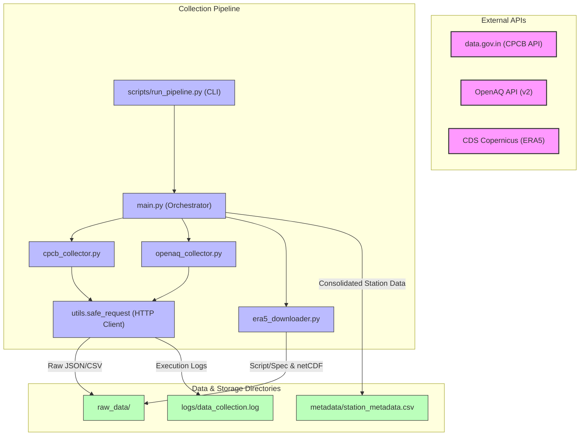

# Data Collection Module Architecture

This document describes the architectural design and data flow of the Data Ingestion module for the **ISRO Bharatiya Antariksh Hackathon 2026** AQI & HCHO pipeline.

---

## 🏛️ Architectural Overview

The module follows a decoupled, library-first architecture. Collectors are designed as stateless reusable modules that are invoked via a centralized orchestrator (`main.py`) or manually via standalone commands in the `scripts/` directory.

### Structural Flow Diagram

---

## 🛠️ Key Design Choices

### 1. Robust Retry Policy (Exponential Backoff)
All REST requests pass through `utils.safe_request`. If the remote server returns a transient error or experiences a timeout, the request is retried:
- **Maximum Retries**: 3
- **Backoff Algorithm**: $SleepTime = Base^{Attempt}$ (where Base = 2.0 seconds)
- If all attempts fail, the API call returns `None` and triggers a warning, continuing the pipeline execution with a mock data fallback instead of crashing the process.

### 2. Mock Fallback Mode (Key-less Execution)
To facilitate testing, local runs, and unit validation, both the CPCB and OpenAQ modules fall back to generating synthetic, highly realistic dataset outputs if:
- Required API keys are empty in `config.py` (i.e., not configured in `.env`).
- API calls return status codes other than `200 OK` (e.g. rate limit, auth errors, server down).

### 3. Station Geo-Enrichment and Merging
Because the CPCB `data.gov.in` real-time resource does not contain geographic latitude/longitude columns, the orchestrator (`main.py`) enriches this data by:
- Cross-referencing city names with a coordinate lookup dictionary defined in `utils.py`.
- Merging CPCB station names with OpenAQ stations (which natively contain GPS coordinates) where they match, providing high-precision location data in the compiled `metadata/station_metadata.csv`.

### 4. ERA5 Data Preparation Safety
Meteorological reanalysis NetCDF files cover large spatial boundaries and can be gigabytes in size. To prevent automatic data floods:
- By default, the `era5_downloader` writes the JSON query structure (`raw_data/era5_request_spec.json`) and a python execution script (`raw_data/download_era5_script.py`) instead of triggering the download.
- Users can run the download separately or run the pipeline with the `--no-dry-run` flag to execute live downloads.
